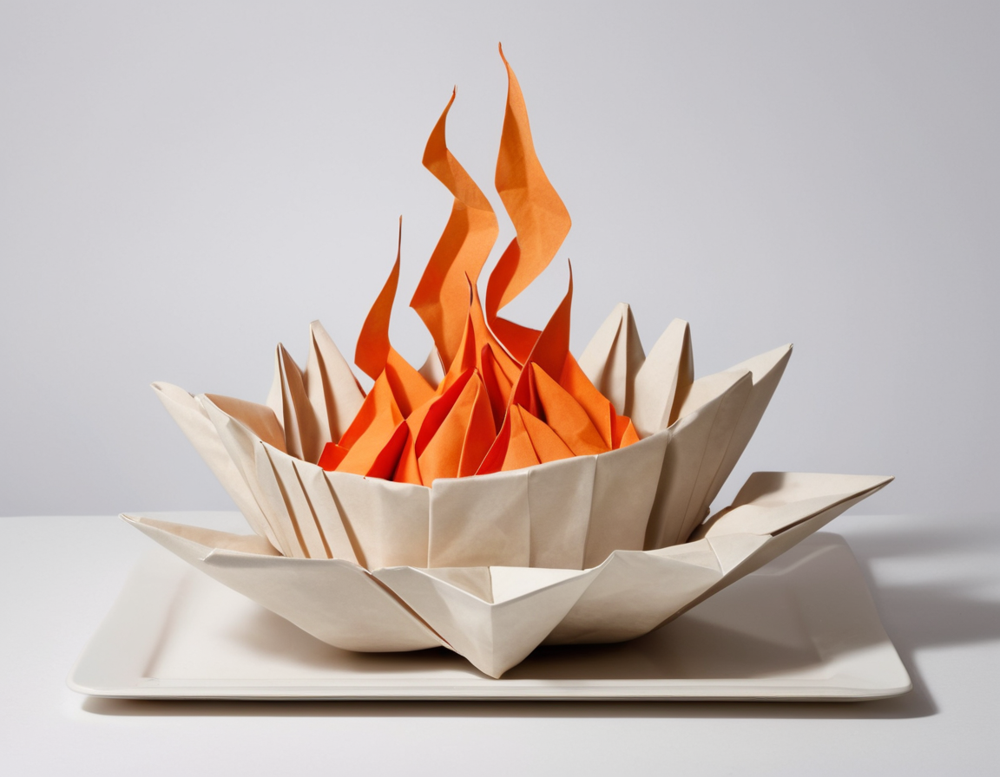

Are you ready to embark on a culinary adventure filled with laughter, mishaps, and a sprinkle of chaos? Welcome to "The Chronicles of Kitchen Disasters," where amateur cooks bravely face the trials and tribulations of the culinary world. From burnt offerings to culinary catastrophes, these tales of kitchen chaos will leave you simultaneously cringing and nodding in solidarity.

In the hallowed halls of home kitchens everywhere, aspiring chefs don their aprons with determination, armed with recipes and dreams of gastronomic glory. Yet, as pots simmer and pans sizzle, chaos lurks just around the corner. Picture this: smoke billowing from the oven, a frantic search for missing ingredients, and the dreaded moment when a well-intentioned dish transforms into an unrecognizable culinary catastrophe.

But fear not, for amidst the chaos lies a treasure trove of laughter and learning. Every spilled ingredient, every overcooked meal, and every baking blunder becomes a chapter in the grand saga of kitchen adventures. These tales remind us that even the most seasoned chefs once burned a batch of cookies or mistook salt for sugar. In the kitchen, as in life, it's not the mistakes that define us but how we embrace them with humor and humility.

So, dear reader, join us as we journey through "The Chronicles of Kitchen Disasters," where every mishap is a recipe for laughter and every catastrophe a lesson in resilience. Let's celebrate the messy, the imperfect, and the deliciously chaotic moments that make the kitchen the heart of every home. After all, in the kitchen of life, disasters are just another spice in the recipe of experience.